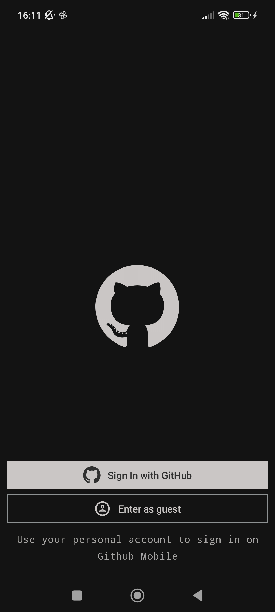
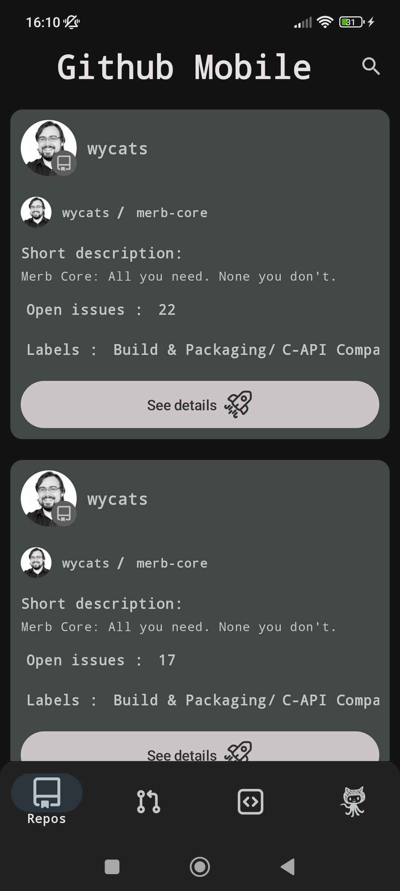
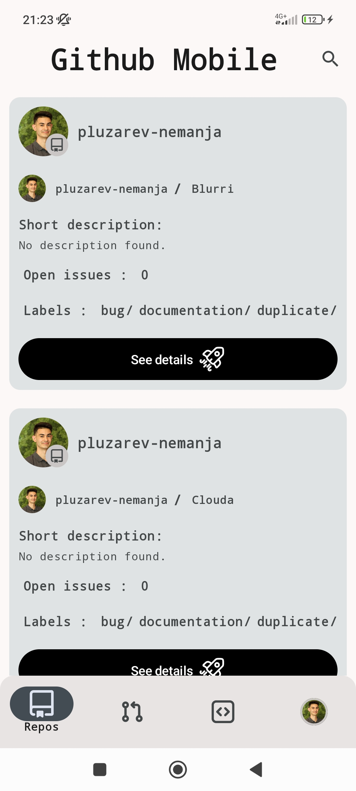
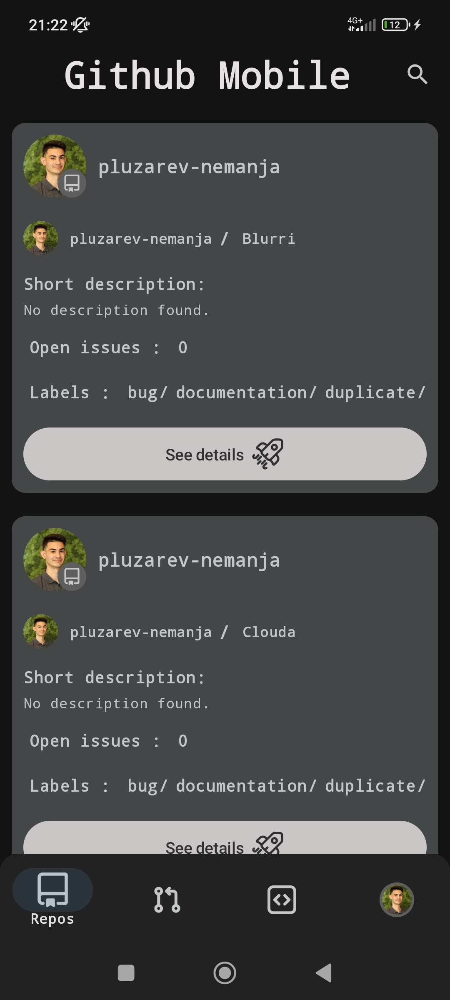
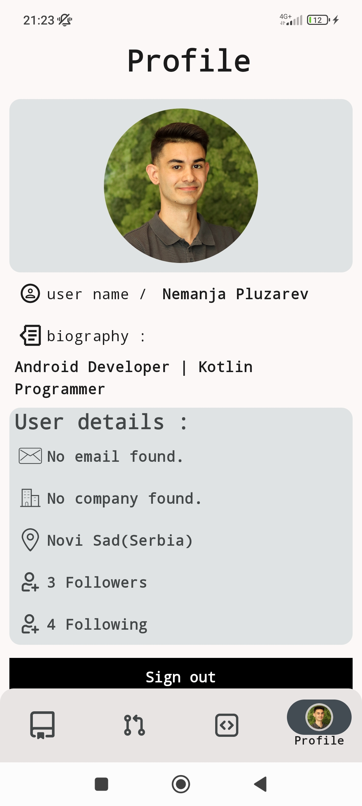
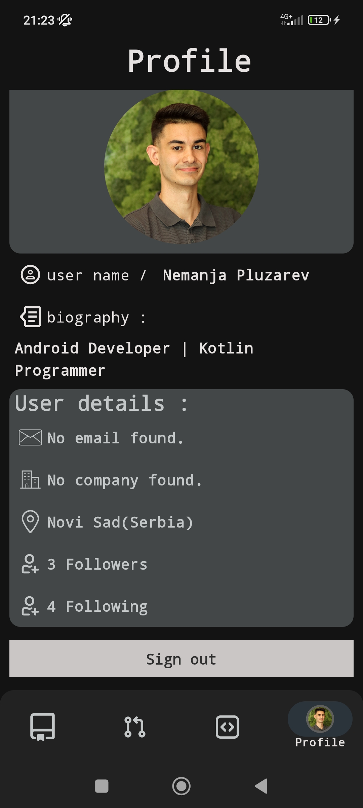
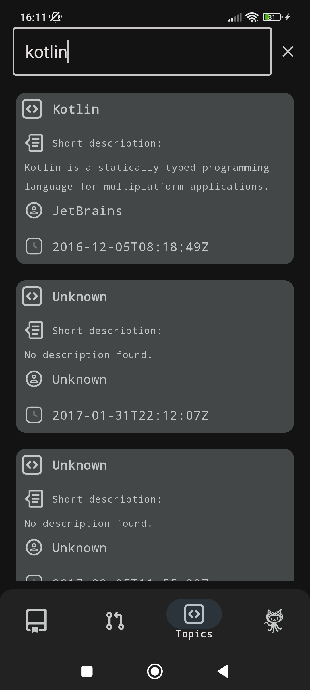
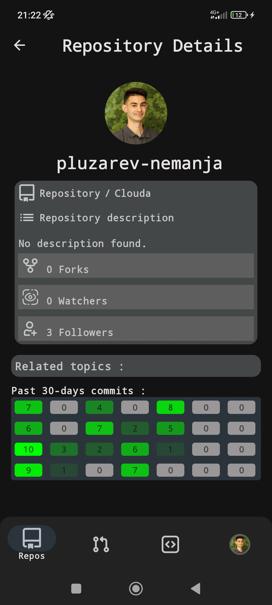
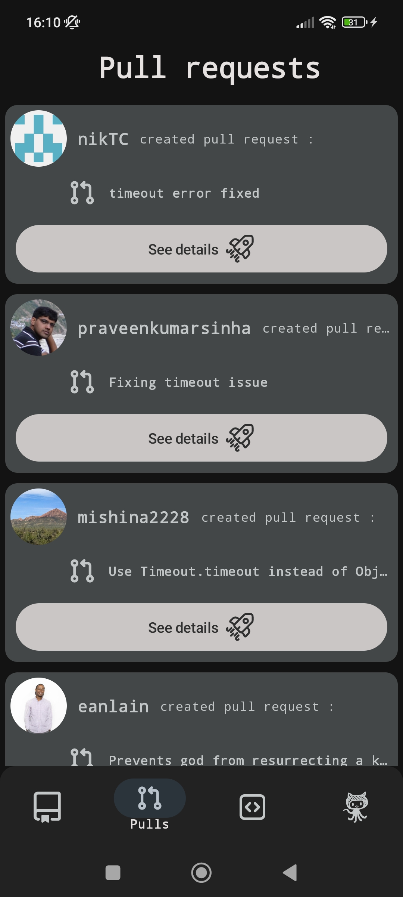

    
    <h1 align="center">Github Clone</h1>

  
  

## 🌐 About app

This application is clone of Github Mobile app using Github public API.It implements OAuth login feature with Github.App can send notifications with Firebase FCM.
App supports listing of all your repositories,search and many more functionalities.

## 📸 Screenshots

Take a look at some screenshots of the app:

### 🔑 Login & Guest Mode

  
  

- **Login Screen**: Authenticate using GitHub OAuth.
- **Guest Mode Screen**: Access the app without signing in.

---

### 🏠 Home & Profile

  
  
  
  

- **Home Screen**: View your repositories or public repositories.
- **Profile Screen**: Access your account details and repositories.

---

### 🔎 Search & Repositories

  
  
  

- **Search Screen**: Search for topics or repositories.
- **Repository Screen**: Explore details about a specific repository.
- **Pull Requests Screen**: View and manage pull requests.

---

## 🧭 Navigation never been made easier 
Self-explanatory interface without overloaded menus.

## 🎨 Colorful
You can choose between two different main themes: White and Dark.

## 🏠 Home
Where you can view your repositories(if your logged in) or public repositories.

## 💡 Details
Where you can see details of specific repository you clicked on.

## 🔎 Search
Search screen where you can search topics or repositories.

## 📦 Included Features
-  Base 2 themes (White,Dark)
-  Splash screen
-  Animations while navigating
-  Bottom navigation bar
-  Login screen
-  Login form
-  List of public repositories or your repositories(if you are logged in)
-  Search screen for topics
-  Profile screen
-  Notifications from Firebase FCM
-  Analytics for better user experience
-  Chrashlytics
-  Unit tests

## 👨‍💻 Used technologies
-  Kotlin programming language
-  Jetpack Compose
-  Kotlin Flow
-  Kotlin coroutines
-  Retrofit
-  Koin
-  Coil(image loading library)
-  Clean architecture
-  MVVM design pattern
-  Use cases
-  Multi Module Architecture
-  Material 3 design
-  Splash screen API
-  Compose navigation
-  Google Analytics
-  Google Chrashlytics
-  Firebase FCM
-  OAuth authentication
-  Pager 3
-  Mockk (Unit tests)
